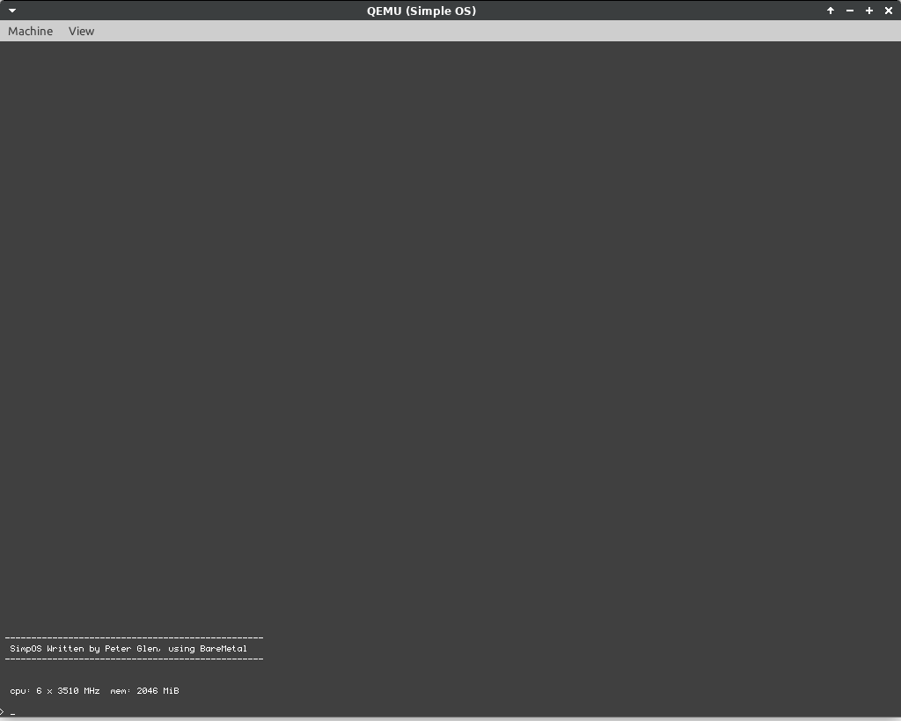

# SimpOS
## Simple OS

## Requirements

    when building on Linux:

        gcc qemu build-essentials

## Initial configuration

    x86_64

## Building the source code

	./build.sh

## Test the installation with QEMU

	./run.sh

 Inspired by BareMetal

// EOF
